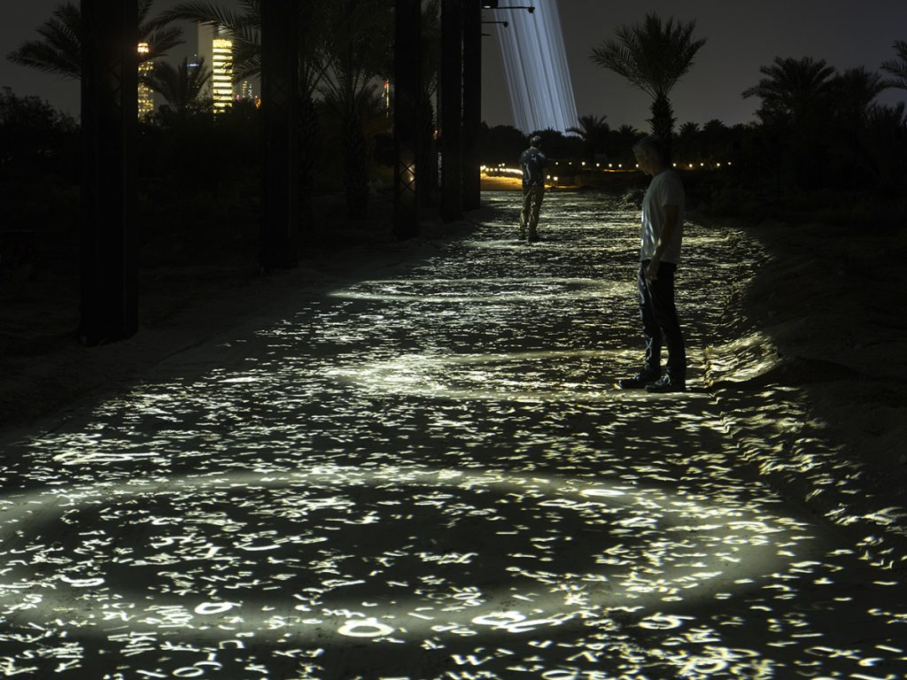

# CONFÉRENCE DE JADE SÉGUELA - STUDIO DE ANTIMODULAR - RAFAEL LOZANO-HEMMER

## PRÉSENTATION - JADE SÉGUELA

Jade Séguéla exerce la profession de **registraire** qui consiste à gérer, exposer et documenter la collection artistique d'un créateur en art numérique. Dans son cas, elle travaille pour le **studio de *antimodular*** créer par **Rafael Lozano-Hemmer**. Elle est graduée du **collégial** avec un **DEC en Arts et Lettres / spécialisation en multimédia**. Mais également, de l'**université** avec un **diplôme *Bachelor of Fine Arts* et une Maîtrise en Muséologie**.

## THÈME PRÉSENTÉ

La conférencière détaille son expertise dans son domaine tout en présentant les projets réalisés durant les dernières années par son studio. Elle explique les complications et les difficultés qu'elle a rencontrée dans son parcours et comment elle a su remédier à ses problèmes selon les situations qui lui fesait face. Elle nous explique aussi, la construction de l'équipe du studio *antimodular*, elle nous présente le fondateur du studio de *antimodular*, qui est **Rafael Lozano-Hemmer**, et certains de ses projets artistiques et intéractifs.

-------------------------------------

## L'ÉQUIPE DE RAFAEL LOZANO-HEMMER

**Mr. Lozano-Hemmer** est accompagné de **son équipe de gestion** pour réaliser ses nombreux projets artistiques durant sa carrière. Elle est **divisée** de façon à ce que tout le monde aille un **domaine spécifique** et afin qu'une **organisation efficace et productive** soit présente lors de la préparation d'une œuvre multimédia. La répartition des tâches dans l'équipe est la suivante: Recherche et développement (R&D), Production, Legacy et Exhibition.

## PROJET RÉALISÉ PAR *ANTIMODULAR*

### *TRANSLATION ISLAND*

**Description:**

*Translation Island* se compose de **dix œuvres d'art audiovisuelles**, dont six en première mondiale, qui change complètement l'île de Lulu, une île déserte située juste en face du centre-ville d'**Abu Dhabi**. Les visiteurs sont invités à interagir avec les œuvres d'art en parcourant un **chemin éclairé** de deux kilomètres de long.

> *source de l'image:* https://www.timeoutabudhabi.com/culture/manar-abu-dhabi-light-installations-mangroves

## RAFAEL LOZANO-HEMMER

**faits sur l'artiste:**

Il est née le 17 novembre 1967 à Mexico au Mexique. (56ans)
Il a réalisé un Baccalauréat en chimie physique de l'Université de Victoria en Colombie-Britannique.
**Mr. Lozano-Hemmer** réalise ses arts à l'aide d'un concept appelé: **architecture relationnelle**. Ce concept a pour but d'utiliser les batistes et de **transformer** leur première fonction en les rendant plus **artistiques et intéractives**.

> *source:* https://fr.wikipedia.org/wiki/Rafael_Lozano-Hemmer
-------------------------------------

## RESSENTI VIS-À-VIS LA PRÉSENTATION

La présentation était **palpitante**. J'ai pu découvrir une **nouvelle branche de métier** dans le **multimédia** que je ne connaissais pas du tout et j'ai trouvé cela très agréable à découvrir. **Mme. Séguéla** présentait bien ses sujets et elle m'a faite découvrir un univers de mon domaine d'étude complètement unique.

