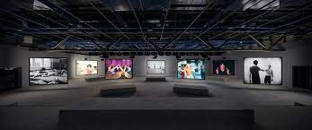

# MA VISITE À LA FONDERIE DARLING POUR L'EXPOSITION *PHASE SHIFTING INDEX* PAR JEREMY SHAW

Façade de la Fonderie Darling

> photo prise par Antoine Barrette Sévigny

# DESCRIPTION DE L'OEUVRE

> **Source:** <https://macm.org/en/exhibitions/jeremy-shaw/>

Cette installation immersive combine son, vidéo et lumière à partir de vidéo VHS, 16mm et Hi-8 de plusieures époques, afin de donner un rendu plongeant le visiteur dans une boucle temporelle, et ce, à l'aide de multiples phases distinctes.

**Année de réalisation:** 2020 

**Type d'exposition:** itinérante

**Réalisé par:** Jeremy Shaw

**Type d'installation:** immersive

**Disposition de l'oeuvre:** 7 écrans disposés en zig-zag font face à un banc, ainsi qu'une rangée de banc installée dans le fond de la pièce.

# DESCRIPTION DE L'ARTISTE

Jeremy Shaw, née en 1977, est un artiste de renommé mondial ayant fait une multitude d'expositions au cours de sa carrière. Il s'inspire de plusieurs domaines artistiques pour réaliser ses oeuvres tels que: des vidéoclips, cinéma-vérité, de l’art conceptuel, etc...

**Lieux d'expositions individuelles:** Centre Pompidou à Paris, au MoMA PS1 à New York, au Schinkel Pavillon à Berlin, et au MOCA à Toronto.

> **Source:** <https://macm.org/expositions/jeremy-shaw/>

# COMPOSANTS ET TECHNIQUES

toiles blanches pour la diffusion, des rails, des projecteurs, des haut-parleurs répartis également dans toute la pièce, des lumières, console dans les bancs pour maximiser le rendu visuel, des cables pour maintenir le matériel en place. 

**COMMENT?**

Tout ces dispositifs ont pu être installés, grâce au support des rails se trouvant dans le plafond de la salle.

Rails à des fins d'installations techniques

> photo prise par Antoine Barrette Sévigny

# EXPÉRIENCE VÉCUE

Une expérience profonde et émouvante que j'ai ressenti. J'ai ressenti une vraie connexion avec le moi intérieur et un profond mélange d'incompréhension et de sensation qui traversait mon corps durant les différentes phases de la présentation. Je me sentais libre et investi pleinement dans l'art qui m'était présenté.

# CE QUI M'AS PLU

L'immersion totale dans laquelle l'oeuvre m'as plongé. Cela m'a inspiré vers de futurs projets audios émouvants et des vidéos remplies d'énergie.

# CE QUI M'AS MOINS INSPIRÉ

Je ne souhaite pas inviter des gens à consommer toutes sortes de stupéfiants, à des fins de création artistique à cause de valeurs personnelles.
