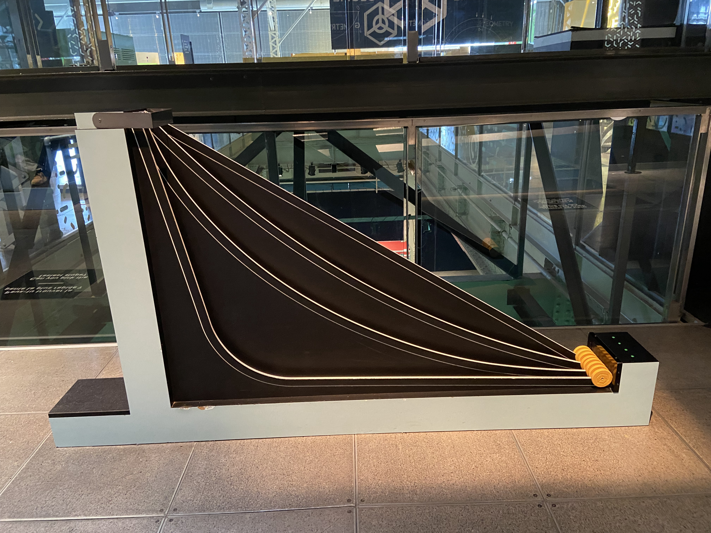
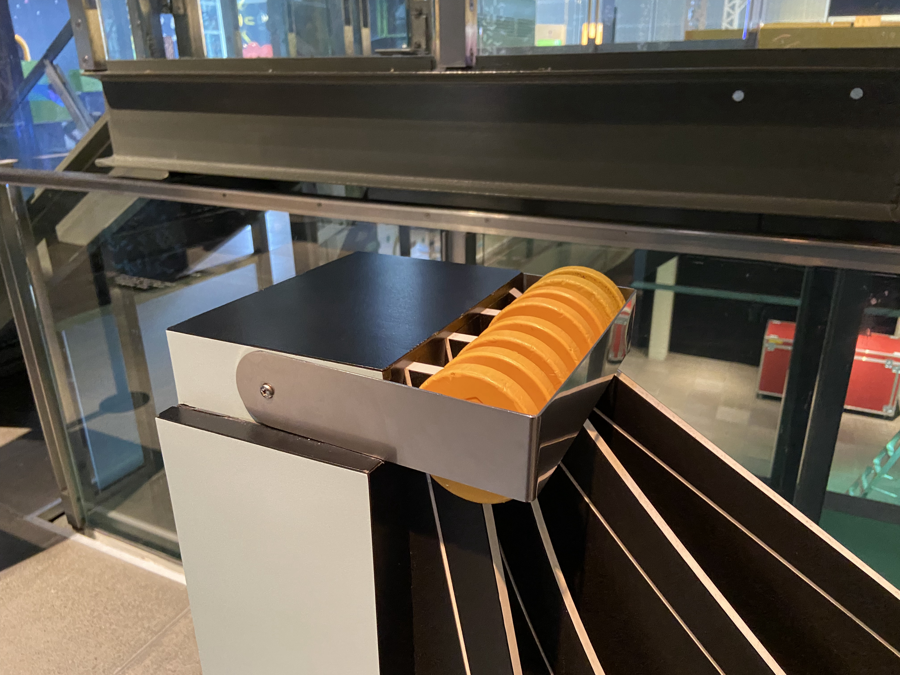
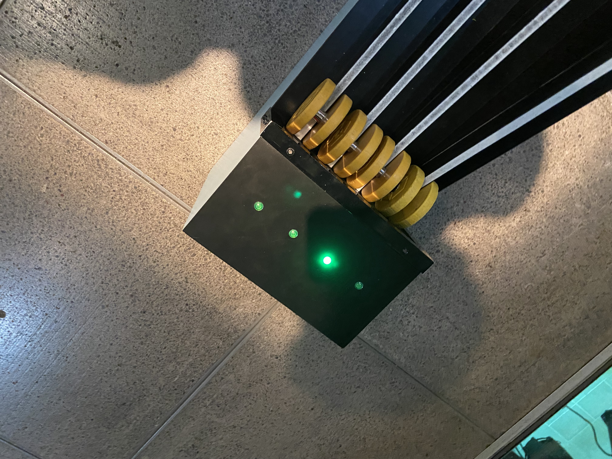
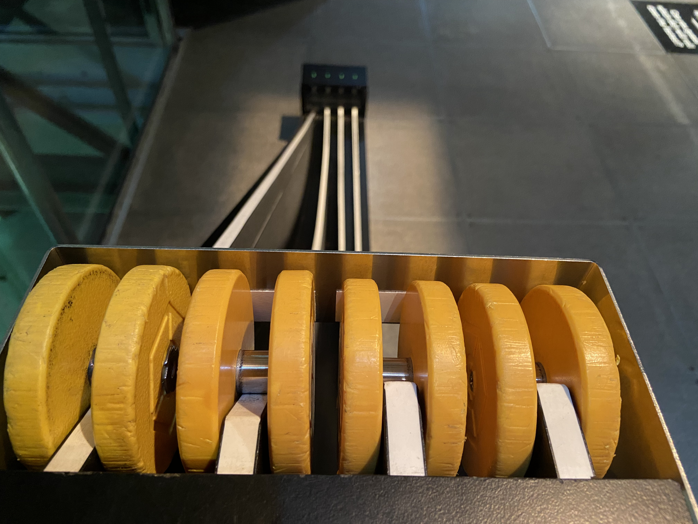

# VISITE AU CENTRE DES SCIENCES DE MONTRÉAL - Explore La Science En Grand

> source photo: https://fr.wikipedia.org/wiki/Centre_des_sciences_de_Montr%C3%A9al

**Date de la visite:** 05/04/2024

## Description:

Le centre des sciences de Montréal est un musée scientifique qui a pour but de promouvoir la science dans toutes ses sphères. Les principales catégories présentées sont la mécanique, l'air, la lumière, l'eau, la géométrie, la matière et le code.

**informations supplémentaires:**

**Date de création:**

Le centre des sciences a été créé en 1982.

**Sa localisation:**

Le centre des sciences se trouve au Vieux-Port de Montréal.

**Nom originel:**

Les expositions Expotec. était le nom de base est a été changé en 2002.

> source informations: https://fr.wikipedia.org/wiki/Centre_des_sciences_de_Montr%C3%A9al
## Dispositif personnelle:

> photo prise par Antoine Barrette Sévigny

**Description:**

Le dispositif que j'ai choisi ce trouve dans la sphère mécanique de l'exposition "Explore La Science En Grand". Son but consiste à analyser le pourquoi du comment que chacuns des chemins entrepris diffère.

**Composantes et techniques:**

**Les composantes du dispositif:**

- Roues mécaniques (faites en plastique et en métal)
- chemins avec différentes courbures (faites en bois)
- boitier électriques (fait en métallique et situé à l'avant du dispositif)
- module principal (fait en bois et a pour but de solidifié l'ensemble du dispositif)
- braquette (faite en métal pour retenir les roues du dispositif et assurer un départ identique)

  -----------------

**Images à l'appui:**

> photo prise par Antoine Barrette Sévigny

**Technique et fonctionnement:**

Pour que l'information soit acheminée à la lumière, chacune des roues sont composées du petit cylindre métallique permettant de transmettre un signaux électromagnétique qui permet la fermeture du circuit électrique. C'est donc de cette manière que la lumière du dispositif s'allume pour déterminer qu'elle est la première roue à être arrivée à la fin de la course.

**Expérience:**

Lorsque que l'on voit ce dispositif, une seule question parvient à l'esprit: Quelle roue arrivera la première en bas? La seule manière de pouvoir le savoir c'est en l'essayant. C'est comme si quelqu'un dans notre tête nous obligeait à prendre part à cette expérience sans que l'on ne le soit vraiment. On peut être intriguer, épaté et surpris par la vitesse de chacune des trajectoires et c'est ce que j'ai ressenti en tant qu'utilisateur du dispositif.

