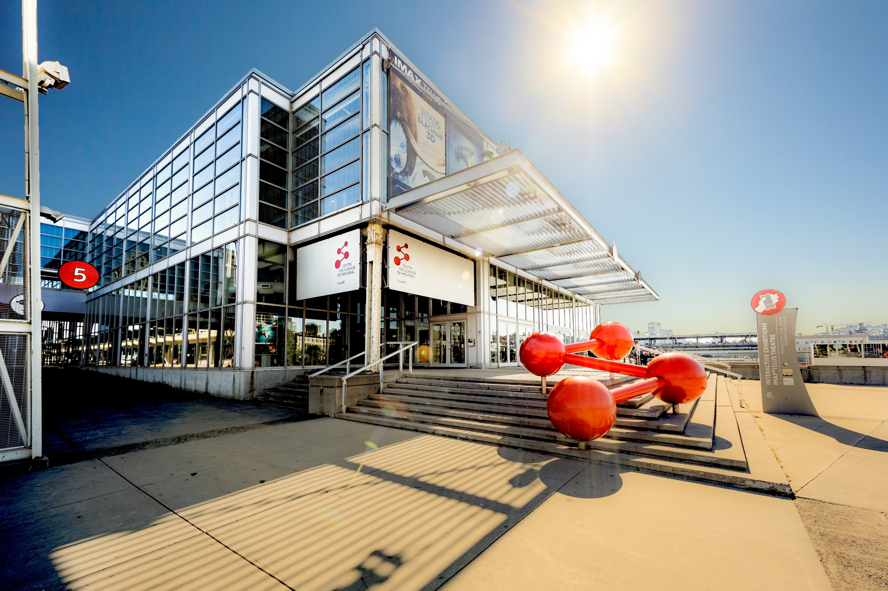

# VISITE AU CENTRE DES SCIENCES DE MONTRÉAL - Explore La Science En Grand

> source photo: https://fr.wikipedia.org/wiki/Centre_des_sciences_de_Montr%C3%A9al

**Date de la visite:** 05/04/2024

## Description:

Le centre des sciences de Montréal est un **musée scientifique** qui a pour but de **promouvoir la science** dans toutes ses sphères. Les principales catégories présentées sont **la mécanique, l'air, la lumière, l'eau, la géométrie, la matière et le code**.

**informations supplémentaires:**

**Date de création:**

Le centre des sciences a été créé en 1982.

**Sa localisation:**

Le centre des sciences se trouve au Vieux-Port de Montréal.

**Nom originel:**

Les expositions Expotec. était le nom de base est a été changé en 2002.

> source informations: https://fr.wikipedia.org/wiki/Centre_des_sciences_de_Montr%C3%A9al
## Dispositif personnelle:

## Description:

Le dispositif que j'ai choisi ce trouve dans la **sphère mécanique** de l'exposition "Explore La Science En Grand". Son but consiste à analyser le **pourquoi du comment** que chacun des chemins entrepris diffère.

## Composantes et techniques:

**Les composantes du dispositif:**

- Roues mécaniques (faites en plastique et en métal)
- chemins avec différentes courbures (faites en bois)
- boitier électriques (fait en métallique et situé à l'avant du dispositif)
- module principal (fait en bois et a pour but de solidifié l'ensemble du dispositif)
- braquette (faite en métal pour retenir les roues du dispositif et assurer un départ identique)

> photo prise par Antoine Barrette Sévigny

  -----------------

**Images à l'appui:**

> photo prise par Antoine Barrette Sévigny

**Technique et fonctionnement du dispositif:**

Pour que l'information soit acheminée à la lumière, chacune des roues sont composées du **petit cylindre métallique** permettant de transmettre un **signaux électromagnétique** qui permet la **fermeture du circuit électrique**. C'est donc de cette manière que la lumière du dispositif s'allume pour déterminer qu'elle est la première roue à être arrivée à la fin de la course.

**Ce qui m'as plus du dispositif:**

Lorsque que l'on voit ce dispositif, une seule question parvient à l'esprit: **Quelle roue arrivera la première en bas?** La seule manière de pouvoir le savoir c'est en l'essayant. C'est comme si quelqu'un dans notre tête nous obligeait à prendre part à cette expérience sans que l'on ne le soit vraiment. On peut être **intriguer, épaté et surpris par la vitesse** de chacune des trajectoires et c'est ce que j'ai ressenti en tant qu'utilisateur du dispositif.

## Expérience de ma visite:

**Ce qui m'as plus:**

Ma visite au centre des sciences a été **très agréable**. J'ai pu découvrir pleins de dispositifs tout en m'amusant avec mes amis. J'ai aimé comment chacune des catégories sont biens séparéss et mise en évidence pour les visiteurs. La **simplicité à la compréhension** de tout les dispositifs laisse vraiment un ressenti d'un **endroit familial et chalheureux**.

**Ce qui m'as moins plus:**

J'ai moins apprécié le fait que ce soit surtout **pour les enfants**, mais sinon, je n'ai pas de points négatifs a plus approfondir sur ma visite.

