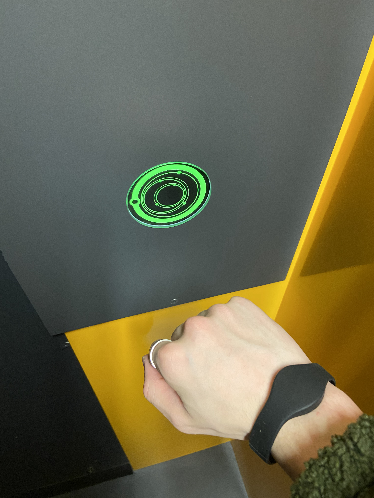

# VISITE AU COSMODÔME DE LAVAL

**Façade du Cosmodôme de Laval**

> source: https://courrierlaval.com/le-cosmodome-coute-a-la-ville-15-m-par-annee/

## MISSIONS VIRTUELLES

Les missions virtuelles sont un atout du Cosmodôme. Ce sont des attractions pour les visiteurs depuis 2012 et contabilise 3 parcours différents.

## AUX FRONTIÈRES DU COSMOS

**Description de la mission:**

Cette installation permet au visiteur de s'immerger dans un ambiance spatiale et futuriste de façon époustouflante. Le but est de partir à la visite des planètes du système solaire tout en apprenant les fonctionnements des engins aérospatiales.

**Année de réalisation:** 

Elle a été réalisé en 2012.

**Type d'exposition:** 

C'est une installation permanente.

**Réalisé par:** 

Elle a entièrement été créé par Le Cosmodôme.

**Type d'installation:** 

C'est une installation immersive.

**Disposition de l'oeuvre:** 

Plusieurs dispositifs intéractifs sont présents dans chacunes des pièces de façon à ce que cela raconte une histoire. Certaines pièces sont à titre de présentations vidéos informatives et d'autres sous forme de défis

> **Source:** https://cosmodome.org/activites-familiale/missions-virtuelles/

# COMPOSANTS ET TECHNIQUES

L'utilisation de bracelets codés permet de passer d'une pièce à l'autre et de s'identifier entre chaque mission. La projection de films sur de grands écrans et les tablettes tactiles font parties également de l'oeuvre.

# CE QUI M'AS PLU

J'ai voyagé dans l'espace et le temps. J'ai réussi à vraiment être investi dans l'expérience et j'ai adoré ma sortie. J'ai pu découvrir mieux en profondeur la planète de Saturne et sa composition.

# CE QUI M'AS MOINS PLU

Les tablettes tactiles commence a avoir de l'âge. Ils avaient beaucoup de difficultés à répondre lors de leur intéraction.
