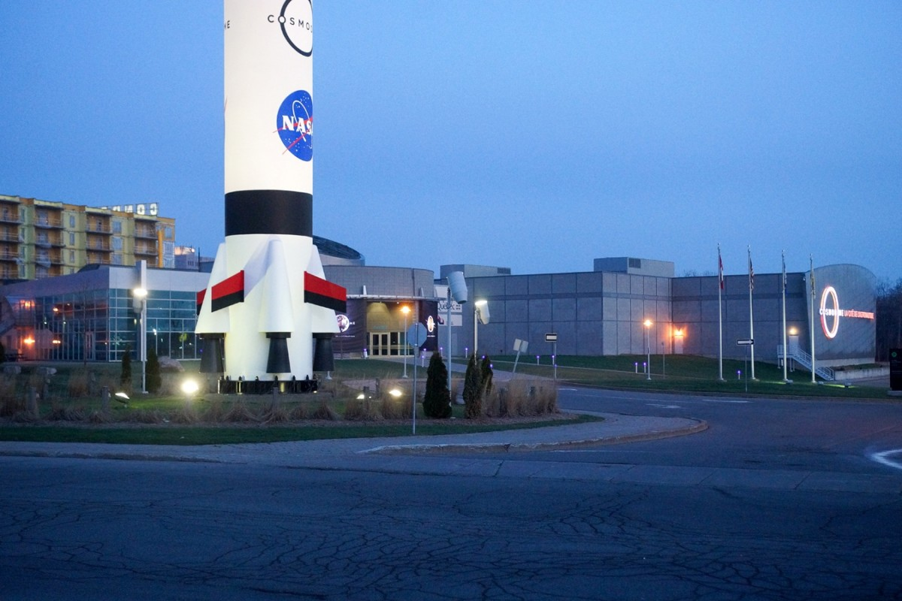
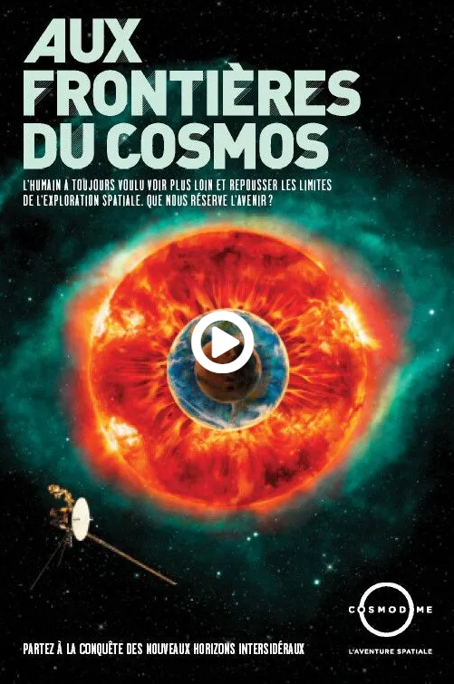

# VISITE AU COSMODÔME DE LAVAL

**Façade du Cosmodôme de Laval**

> source: https://courrierlaval.com/le-cosmodome-coute-a-la-ville-15-m-par-annee/

## MISSIONS VIRTUELLES

Les missions virtuelles sont un atout du Cosmodôme. Ce sont des attractions pour les visiteurs depuis 2012 et contabilise 3 parcours différents.

## AUX FRONTIÈRES DU COSMOS

> **Source:** https://cosmodome.org/activites-familiale/missions-virtuelles/

**Expérience visiteur:**

Cette installation permet au visiteur de s'immerger dans un ambiance spatiale et futuriste de façon époustouflante. Le son est réparti dans toute les pièces de façon à ce que le l'utilisateur puisse être investi pleinement dans l'expérience pendant sa naviguation 

**Année de réalisation:** 

2012

**Type d'exposition:** 

permanente

**Réalisé par:** 

Le cosmodôme

**Type d'installation:** 

immersive

**Disposition de l'oeuvre:** 

Plusieurs dispositifs intéractifs sont présents dans chacunes des pièces de façon à ce que cela raconte une histoire.

============================

# COMPOSANTS ET TECHNIQUES

L'utilisation de bracelets codés permet de passer d'une pièce à l'autre et de s'identifier entre chaque mission. La projection de films sur de grands écrans et les tablettes tactiles font parties également de l'oeuvre.

**COMMENT?**

Tout ces dispositifs ont pu être installés, grâce au support des rails se trouvant dans le plafond de la salle.

Rails à des fins d'installations techniques

> photo prise par Antoine Barrette Sévigny

# EXPÉRIENCE PERSONNELLE

Une expérience profonde et émouvante que j'ai ressenti. J'ai ressenti une vraie connexion avec le moi intérieur et un profond mélange d'incompréhension et de sensation qui traversait mon corps durant les différentes phases de la présentation. Je me sentais libre et investi pleinement dans l'art qui m'était présenté.

# CE QUI M'AS PLU

L'immersion totale dans laquelle l'oeuvre m'as plongé. Cela m'a inspiré vers de futurs projets audios émouvants et des vidéos remplies d'énergie.

# CE QUI M'AS MOINS INSPIRÉ

Je ne souhaite pas inviter des gens à consommer toutes sortes de stupéfiants, à des fins de création artistique à cause de valeurs personnelles.
